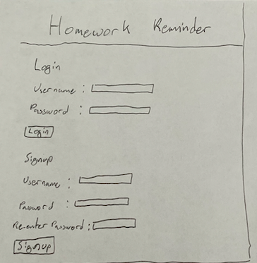
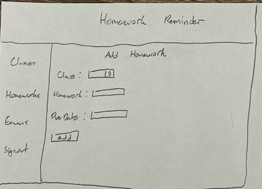
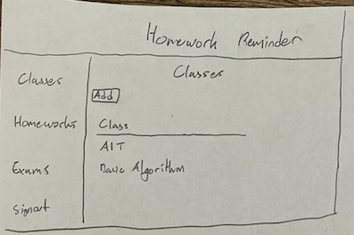
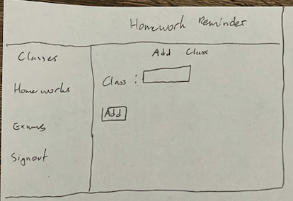
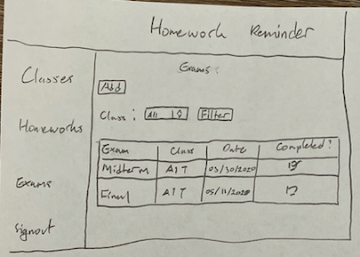
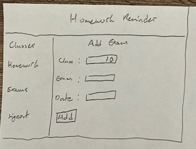
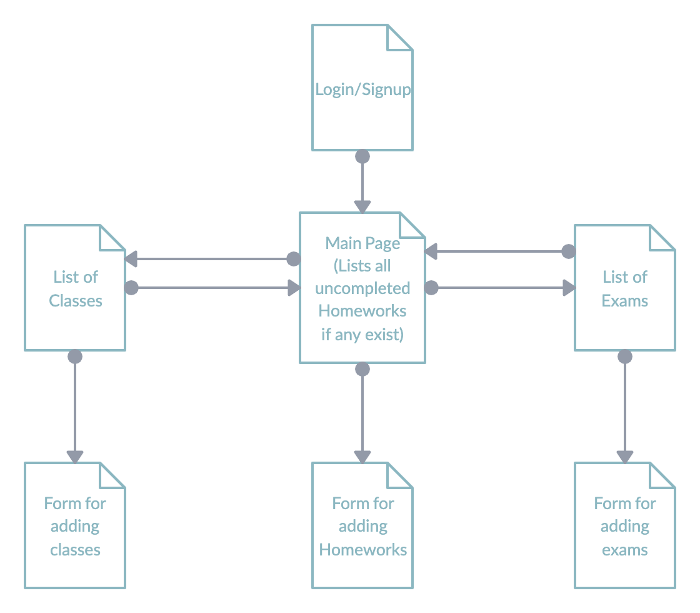

# Homework Reminder

## Overview

Keeping track of all your homeworks, projects and exams can be stressful. It's easy to forget something and miss a deadline. That's where Homework Reminder comes in.

Homework Reminder is a web app that allows users to keep track of all their homeworks/projects and exams. Users can register and login. Once logged in, they can add the different classes they are taking, and a list of homeworks or projects with their due dates. Once they are done with the homework, they can be checked off and will no longer show on their list. They will be able to view their homeworks by class or all of them on a single page. They can also add exam dates which they can check on a seperate page.

## Data Model

The application will store Users, Classes, Homeworks and Exams

* users will have multiple lists of classes
* each list will contain homeworks and exams for that specific class by embedding

An Example User:

```javascript
{
  username: "dwc291",
  hash: // a password hash,
  lists: // an array of references to List documents
}
```

An Example Class List with Embedded Homeworks and Exams:

```javascript
{
  user: // a reference to a User object
  className: "AIT",
  homeworks: [
    { name: "Final Project", dueDate: "04/01/2020", checked: false},
    { name: "Homework 6", dueDate: "04/01/2020", checked: true},
  ],
  exams: [
    { name: "Midterm", date: "03/30/2020", checked: true},
    { name: "Final", date: "05/11/2020", checked: false},
  ]
}
```

## [Link to Commented First Draft Schema](https://github.com/nyu-csci-ua-0480-008-spring-2020/dwc291-final-project/blob/0efd70f120f19c2ec285a71d775f568acf42aa42/src/db.js#L2) 

## Wireframes

/login - page for logging in and signing up



/homeworks - page listing all homeworks


/homeworks/add - form for adding homeworks



/classes - page listing all classes



/classes/add - form for adding classes



/exams - page for listing all exmas



/exams/add - form for adding exams



## Site map



## User Stories or Use Cases

1. as non-registered user, I can register a new account with the site.
2. as a user, I can log in to the site.
3. as a user, I can create a classes list.
4. as a user, I can add homeworks or exams to the class list.
5. as a user, I can view all of the homeworks, exams or classes on a single page.
6. as a user, I can view homeworks or exams by class on a single page.
8. as a user, I can cross off homeworks and exams in the classes list.

## Research Topics

* (5 points) Integrate user authentication
    * I'm going to be using passport for user authentication
* (3 points) Perform client side form validation using custom JavaScript
    * I'm going to write my own code for client side form validation

8 points total out of 8 required points


## [Link to Initial Main Project File](https://github.com/nyu-csci-ua-0480-008-spring-2020/dwc291-final-project/blob/0efd70f120f19c2ec285a71d775f568acf42aa42/src/app.js#L1) 

## Annotations / References Used

1. [passport.js authentication docs](http://passportjs.org/docs)

